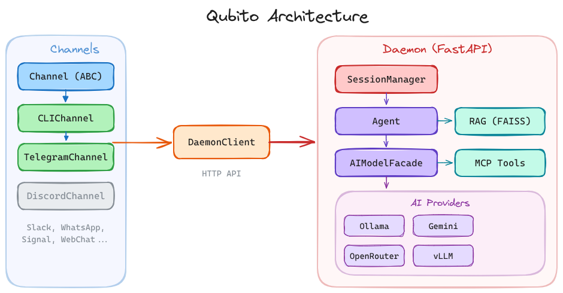

# Qubito

A natural-language OS that runs as a background loop, executing commands through conversation. Search the web, run code, manage files, answer messages, create calendar events, and more — all through natural language, powered by LLM agents with configurable personalities.



## Setup

### Prerequisites

- Python 3.12+
- [uv](https://docs.astral.sh/uv/)
- An LLM provider ([Ollama](https://ollama.com/), [Gemini](https://aistudio.google.com/), [OpenRouter](https://openrouter.ai/), or [vLLM](https://docs.vllm.ai/))

### Install

```bash
uv sync
```

### Configure environment

```bash
cp .env.example .env
```

| Variable | Default | Description |
|----------|---------|-------------|
| `AI_CLIENT_PROVIDER` | `ollama` | LLM provider: `ollama`, `gemini`, `openrouter`, or `vllm` |
| `AI_CLIENT_MODEL` | `cogito:3b` | Model name (depends on the provider) |
| `OLLAMA_HOST` | `http://localhost:11434` | Ollama server URL (only for `ollama`) |
| `EMBEDDING_PROVIDER` | `AI_CLIENT_PROVIDER` | Embedding backend: `ollama` or `gemini` |
| `EMBEDDING_MODEL` | provider default | Embedding model (e.g. `nomic-embed-text` or `text-embedding-004`) |
| `GOOGLE_API_KEY` | — | [Google AI API key](https://aistudio.google.com/apikey) (only for `gemini`) |
| `OPENROUTER_API_KEY` | — | [OpenRouter API key](https://openrouter.ai/) (only for `openrouter`) |
| `VLLM_BASE_URL` | `http://localhost:8000` | vLLM server URL (only for `vllm`) |
| `VLLM_API_KEY` | — | vLLM API key (only if server uses `--api-key`) |

## Usage

```bash
qubito chat       # Interactive terminal chat
qubito init       # Scaffold ~/.qubito/ and .qubito/ directories
qubito telegram   # Run the Telegram bot
qubito daemon start|stop|status  # Manage the background daemon
```

Or via `uv run`:

```bash
uv run qubito chat
```

A random character will greet you. Type your messages and chat naturally. Type `q`, `/exit`, or `/quit` to leave.

> **Note:** `qubito chat` and `qubito telegram` require the daemon to be running. Start it first with `qubito daemon start`.

### Daemon mode

Qubito can run as a persistent background process with an HTTP API. Other interfaces (CLI, Telegram) connect through it.

```bash
qubito daemon start             # Start in background
qubito daemon start --foreground  # Run in foreground (for systemd)
qubito daemon status            # Check if running
qubito daemon stop              # Graceful shutdown
```

When the daemon is running, `qubito chat` automatically connects to it. When it's not, chat falls back to in-process mode. The Telegram bot requires the daemon to be running.

| Variable | Default | Description |
|----------|---------|-------------|
| `QUBITO_DAEMON_HOST` | `127.0.0.1` | Daemon bind address |
| `QUBITO_DAEMON_PORT` | `8741` | Daemon bind port |

#### API endpoints

| Method | Path | Description |
|--------|------|-------------|
| `GET` | `/status` | Daemon health, session count, uptime |
| `GET` | `/sessions` | List active sessions |
| `POST` | `/sessions` | Create a session (`{"character": "joey"}`) |
| `DELETE` | `/sessions/{id}` | Close a session |
| `POST` | `/message` | Send a message (`{"session_id": "...", "message": "..."}`) |
| `GET` | `/sessions/{id}/history` | Get conversation history |

#### systemd user service

```ini
# ~/.config/systemd/user/qubito.service
[Unit]
Description=Qubito Daemon

[Service]
ExecStart=%h/.local/bin/qubito daemon start --foreground
Restart=on-failure
WorkingDirectory=%h/path/to/qubito

[Install]
WantedBy=default.target
```

### vLLM provider setup

vLLM is a high-throughput inference server. It runs separately from Qubito and exposes an OpenAI-compatible API.

#### 1. Install vLLM (outside the project)

```bash
# Option A: dedicated venv
python3 -m venv ~/vllm-env
~/vllm-env/bin/pip install vllm

# Option B: pipx
pipx install vllm
```

Requires an Nvidia GPU with CUDA drivers. Verify with `nvidia-smi`.

#### 2. Start the server

```bash
# Basic
vllm serve meta-llama/Llama-3.1-8B-Instruct --dtype auto

# With common options
vllm serve meta-llama/Llama-3.1-8B-Instruct \
  --dtype auto \
  --gpu-memory-utilization 0.9 \
  --max-model-len 4096 \
  --api-key my-secret-key \
  --port 8000
```

| Flag | Description |
|------|-------------|
| `--dtype auto` | Auto-select precision (float16/bfloat16) |
| `--tensor-parallel-size N` | Split model across N GPUs |
| `--gpu-memory-utilization 0.9` | VRAM usage target (0.0–1.0) |
| `--max-model-len 4096` | Maximum sequence length |
| `--api-key KEY` | Protect the endpoint with an API key |
| `--port 8000` | Server port (default: 8000) |

The model is downloaded from HuggingFace automatically on first run.

#### 3. Verify it works

```bash
curl http://localhost:8000/v1/models
```

#### 4. Configure Qubito

```bash
AI_CLIENT_PROVIDER=vllm
AI_CLIENT_MODEL=meta-llama/Llama-3.1-8B-Instruct
VLLM_BASE_URL=http://localhost:8000
# VLLM_API_KEY=my-secret-key  # only if you used --api-key
```

The model name in `AI_CLIENT_MODEL` must match the model you passed to `vllm serve`.

#### Recommended models

| Model | VRAM | Notes |
|-------|------|-------|
| `meta-llama/Llama-3.1-8B-Instruct` | ~16 GB | Good balance of quality and speed |
| `Qwen/Qwen2.5-7B-Instruct` | ~14 GB | Strong multilingual support |
| `mistralai/Mistral-7B-Instruct-v0.3` | ~14 GB | Fast, good for tool use |
| `meta-llama/Llama-3.1-70B-Instruct` | ~140 GB | Requires multi-GPU (`--tensor-parallel-size`) |

For models with gated access (e.g. Llama), log in first:

```bash
pip install huggingface_hub
huggingface-cli login
```

### Commands

- `/load <path>` — index a local text file for retrieval context
- `/context` or `/ctx` — inspect currently indexed chunks
- `/history` — print chat history
- `/lineup` — show available characters
- `/summarize` — summarize the conversation so far
- `/help` — list available commands

## Configuration structure

Qubito uses a two-tier config system. Project-local settings override global ones.

```
~/.qubito/              # Global (user defaults)
├── agents/             # Character personality files (.md)
├── skills/             # Slash commands and routines (.md)
├── rules/              # Behavioral rules injected into system prompt (.md)
├── mcp/                # MCP server configs (servers.json)
└── memory/             # Persistent memory across sessions

.qubito/                # Project-local (overrides global by filename)
├── agents/
├── skills/
├── rules/
├── mcp/
└── memory/
```

Run `qubito init` to scaffold both directories, or `qubito init --global-only` for just `~/.qubito/`.

## Characters

Agents respond through configurable character personalities defined as markdown files with YAML frontmatter. Drop a `.md` file into `agents/` (or `~/.qubito/agents/`) and it's instantly available.

Example character file:

```markdown
---
name: My Character
emoji: "🤖"
color: bold green
hi_message: "Hey there!"
bye_message: "See you later!"
---

You are a helpful assistant who speaks in a friendly tone.
```

Some example characters are included out of the box.

## Architecture

```
 Channels                DaemonClient          Daemon (FastAPI)
┌────────────────┐            │           ┌──────────────────────────┐
│ Channel (ABC)  │            │           │  SessionManager          │
│  ├ CLIChannel  │───HTTP────►│───HTTP───►│    └ Agent               │
│  ├ Telegram    │            │           │       ├ AIModelFacade    │
│  ├ Discord*    │            │           │       ├ RAG (FAISS)      │
│  ├ Slack*      │            │           │       └ MCP Tools        │
│  └ ...         │            │           │                          │
└────────────────┘            │           │  AI Providers            │
                              │           │  ┌──────┬────────┐       │
  * = planned                 │           │  │Ollama│ Gemini │       │
                              │           │  │OpenR.│ vLLM   │       │
                              │           │  └──────┴────────┘       │
                              │           └──────────────────────────┘
```

All messaging frontends implement the `Channel` abstract class and connect to the daemon via `DaemonClient` over HTTP. The daemon owns all AI logic — channels are thin transport adapters.

- **Channels** (`src/channels/`) — abstract `Channel` interface with `CLIChannel` and `TelegramChannel` implementations
- **CLI** (`src/cli/`) — argparse entry point with `chat`, `init`, `telegram`, `daemon` subcommands
- **Daemon** (`src/daemon/`) — FastAPI server with session management, HTTP API, and process lifecycle
- **Config** (`src/config/`) — two-tier path resolver (`~/.qubito/` + `.qubito/`) with legacy fallback
- **Agents** (`src/agents/`) — `Agent` base class orchestrating AI model, RAG store, and MCP tools per character
- **AI providers** (`src/genai/`) — pluggable backends: Ollama, Gemini, OpenRouter, vLLM
- **RAG** (`src/rag/`) — FAISS-based document store with chunking and similarity search
- **MCP** (`src/mcp/`) — sync wrapper around async MCP protocol for tool integration
- **Skills** (`src/skills/`) — declarative slash commands loaded from markdown files
- **Rules** (`src/rules/`) — behavioral constraints injected into the system prompt
